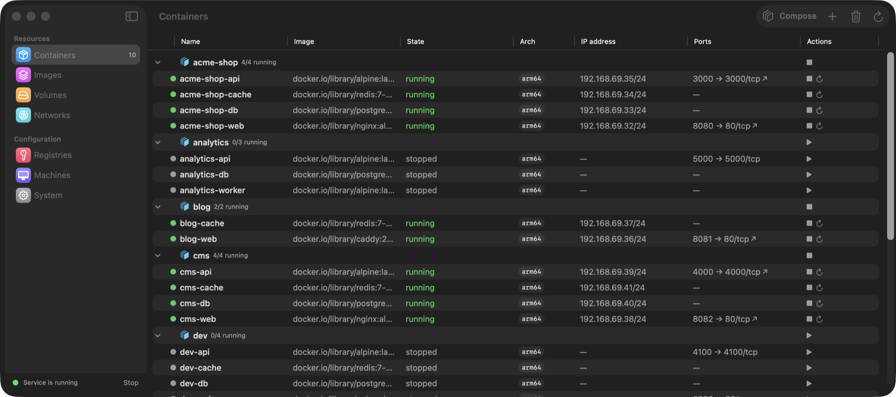
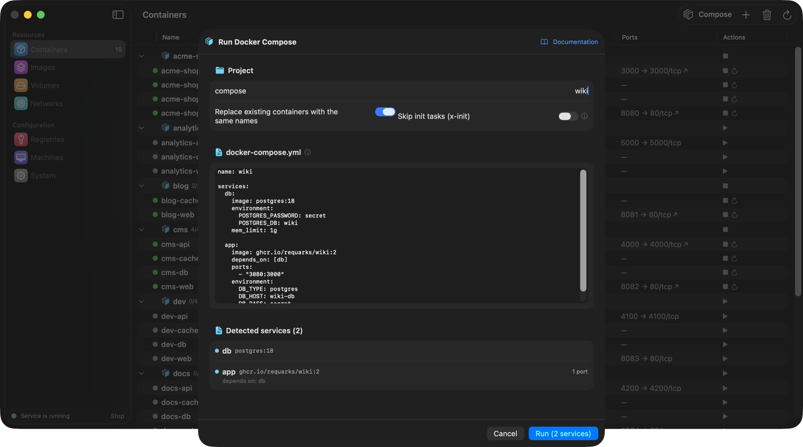
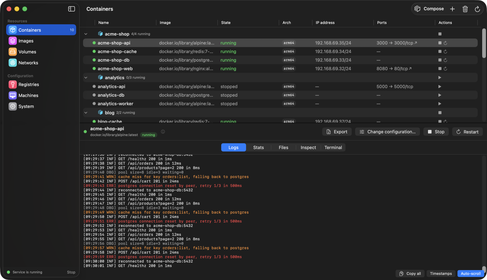
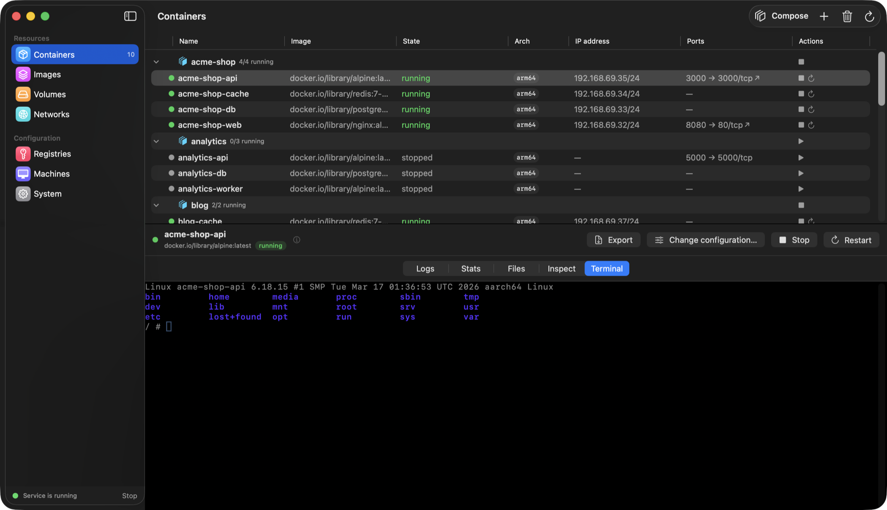
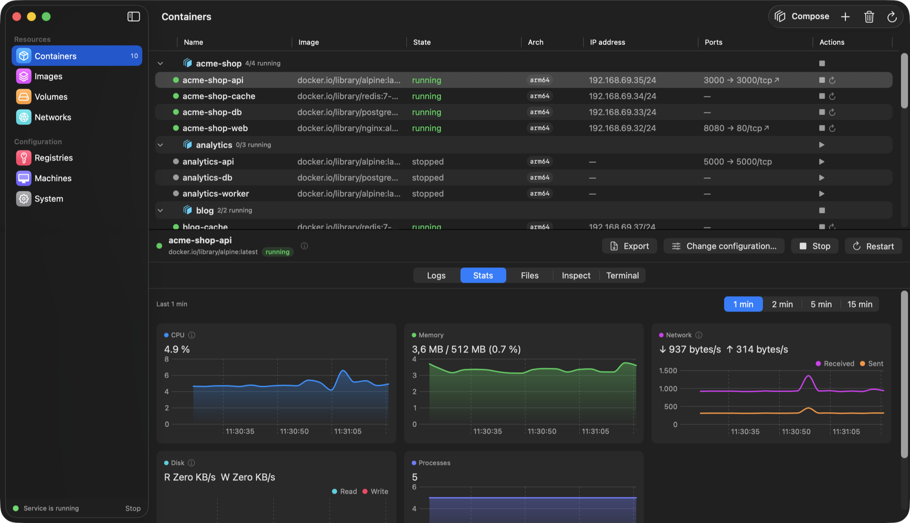
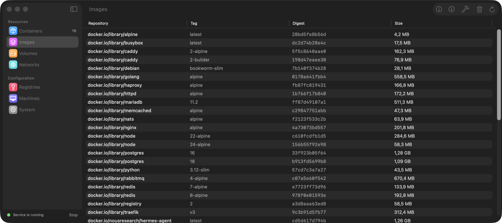
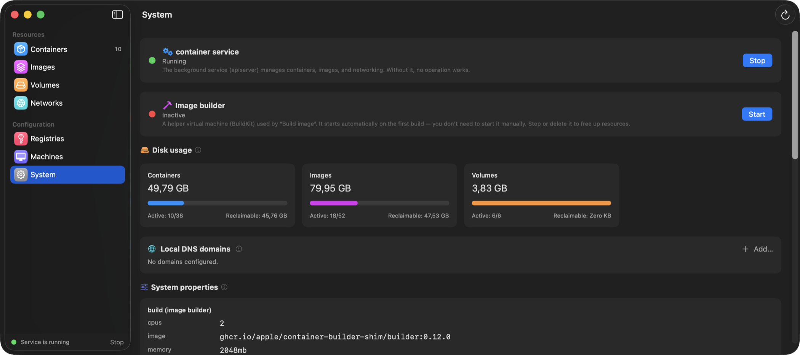
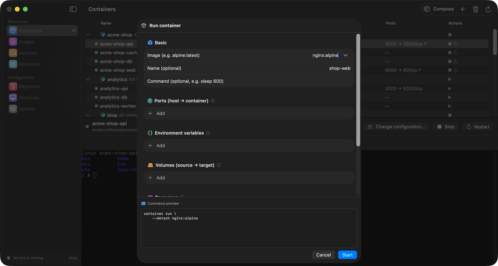

# Container Desktop

**English** | [Polski](README.pl.md) | [简体中文](README.zh-Hans.md)

A native, Docker Desktop-style macOS app for Apple's [`container`](https://github.com/apple/container) CLI — manage containers, images, volumes, networks and machines from a fast SwiftUI interface instead of the terminal.

Container Desktop does not reimplement any container logic: every action shells out to the official `container` CLI and parses its JSON output, so what you see is always exactly what the CLI would tell you.



📘 **[Documentation](https://sembsa.github.io/ContainerDesktop/docs.html)** — Compose guide, `x-init` tasks, `host.containers.internal`, troubleshooting.

## Features

### Containers
- **Card or table view** for the list: cards give each container a state tile, live CPU and memory meters, its ports as clickable chips and the controls that fit its current state; the table stays one click away for dense scanning
- List with live state, IP address and published ports (with one-click **open in browser** arrows); details panel with **logs, live statistics, file browser, inspect and an embedded terminal** (`exec -it` via SwiftTerm)
- Native log viewer: continuous selection, copy-all, optional timestamps and **severity colouring** (errors red, warnings orange) tolerant of serilog/.NET/logfmt/klog syntaxes
- Start / stop / restart / kill / remove / prune, with per-container progress indicators
- Rich **Run container** dialog: ports, environment variables, volumes (pick an existing volume or a local folder), resources, network, architecture (arm64 / amd64 with automatic Rosetta), entrypoint, `--rm` — with a live, copy-pasteable shell preview of the exact command
- **Change command / configuration** of an existing container: the app recreates it with the same configuration pre-filled for editing (volume data survives)
- Live image-pull progress streamed straight into the dialog
- **Docker Compose**: paste a `docker-compose.yml` and the app translates it into `container run` calls — project network, dependency ordering, grouped containers on the list with start/stop-all. One-off setup tasks (e.g. database creation) via the `x-init: true` service extension run to completion before the other services start. The `host.containers.internal` alias resolves to the project network's gateway (your Mac as seen from containers), and service hostnames are wired between containers via `/etc/hosts` (works around the broken name DNS in container 1.0.0). A "skip init tasks" toggle reruns a stack without repeating one-off setup



Logs with severity colouring, and a full terminal inside the container:

| Log viewer | Embedded terminal |
| --- | --- |
|  |  |

### Live statistics

- CPU %, memory, network and disk throughput (per second), process count — refreshed every second
- Native Swift Charts with a selectable time window (1–15 min) and hover tooltips snapped to samples

### Images, volumes, networks, registries, machines

- Pull and build (Dockerfile) with streamed progress, run-from-image, tag / delete / prune / inspect
- Volumes and networks: create, delete, prune, inspect; volume file browser
- Registry logins (password passed securely via stdin)
- Container machines: create, set default, stop, delete

### Kubernetes and Helm
- **Local clusters** through the `container k8s` plugin (container 1.2.1+, marked EXPERIMENTAL by Apple): create with a chosen name, CPU, memory and node image, start, delete, and load a locally built image straight into the cluster's containerd (`load-image`) so pods can use `imagePullPolicy: Never`
- Cluster creation streams its progress — the first run downloads an ~850 MB node image and waits for kubeadm
- If the CLI was upgraded but the background service still runs the older build, the section says so and offers a one-click **service restart** instead of a cryptic XPC error
- **Helm**: repositories (add / remove / update), chart search across them, and releases with upgrade, rollback through `helm history`, and uninstall
- **Dynamic values editor** built from the chart's own `values.yaml`: a generated form with type-aware controls, help text harvested from the file's comments, a key filter, and a raw-YAML tab that stays in sync. Only the keys you actually change end up in `-f`, so chart defaults keep moving with chart upgrades. **Check (dry run)** renders the release on the cluster first, surfacing template errors and `values.schema.json` violations before anything is applied
- Every helm command is pinned to the selected cluster with an app-managed kubeconfig — **your `~/.kube/config` is never read or modified**, so a GUI action cannot reach a production cluster

### Desktop widget
- A **WidgetKit widget** in three sizes: running count with service health (small), a live list with CPU per container (medium), and everything grouped by Compose project (large).
- A widget extension is always sandboxed and cannot run the `container` CLI, so the app writes a snapshot after each refresh and the widget reads it — which also means the widget keeps showing the last known state while the app is closed, and says how old it is.

### System

- Service status with safe start/stop (verifies the result — the CLI swallows some failures), disk usage with reclaimable-space bars, builder management, local DNS domains (admin prompt handled), readable system properties and a built-in service log viewer

### Designed for macOS 26
- Liquid Glass accents, colorful System Settings-style sidebar, transition states everywhere (“Stopping… (stopping containers)”), informative empty states and (i) explainers across the app
- **Menu bar extra**: service status, running containers with one-click stop, “stop all”, jump to any section
- Localized in **English, Polish and Simplified Chinese (简体中文)** — follows the system language, with an in-app language switch in Settings (System / English / 中文 / Polski). Systems set to any other language default to **English**.
- **Automatic updates** via [Sparkle](https://sparkle-project.org): *Check for Updates…* in both the app and menu-bar menus, with an EdDSA-signed appcast served from GitHub Pages



## Requirements

- macOS 26 (Tahoe) on Apple Silicon
- [`container`](https://github.com/apple/container) CLI installed (default: `/usr/local/bin/container`; a custom path can be set in app Settings)
- Optional: [`helm`](https://helm.sh) for the Helm section (`brew install helm`), and `container` 1.2.1+ for local Kubernetes clusters

## Installation

### From a release DMG
Download the DMG from [Releases](../../releases), open it and drag **Container Desktop** to Applications.

> **Note on Gatekeeper:** releases are currently not notarized (no paid Apple Developer membership). On first launch macOS will warn that the app is from an unidentified developer. Open **System Settings → Privacy & Security** and click **Open Anyway**, or remove the quarantine flag manually:
> ```bash
> xattr -dr com.apple.quarantine "/Applications/ContainerGUI.app"
> ```
> Alternatively, build from source — it takes one command.

### Automatic updates
Once installed, Container Desktop checks for updates with [Sparkle](https://sparkle-project.org) (use *Check for Updates…* in the app or menu-bar menu). Updates are verified with an EdDSA signature and Sparkle clears quarantine on the installed update, so after the first launch you won't need the Gatekeeper step again. Maintainer release flow (sign/notarize if available → `generate_appcast` → publish DMG + `docs/appcast.xml`) is documented in `scripts/package.sh`.

### Build from source

```bash
brew install xcodegen
git clone https://github.com/sembsa/ContainerDesktop.git && cd ContainerDesktop
xcodegen generate
xcodebuild -project ContainerGUI.xcodeproj -scheme ContainerGUI \
  -destination 'platform=macOS' -derivedDataPath .build build
open .build/Build/Products/Debug/ContainerGUI.app
```

Tests:

```bash
xcodebuild test -project ContainerGUI.xcodeproj -scheme ContainerGUI \
  -destination 'platform=macOS' -derivedDataPath .build
```

Distributable DMG (ad-hoc signed, no notarization):

```bash
scripts/package.sh        # produces dist/ContainerDesktop.dmg
```

## Architecture

```
SwiftUI views (per feature)  →  @Observable stores  →  ContainerCLI (actor)  →  Process(container CLI)
        │                              │                       │
   MenuBarExtra                  AppModel (root)         JSON (Codable) / line streams (AsyncStream)
   Embedded terminal (SwiftTerm, PTY)
```

- `ContainerGUI/CLI` — process execution with timeouts and watchdog, argv builder with a shell-style tokenizer, streaming line reader
- `ContainerGUI/Models` — `Codable` models mapped to real CLI JSON output
- `ContainerGUI/Features/*` — one store + views per section
- App runs outside the App Sandbox (it spawns an external CLI), so distribution is direct (DMG), not the Mac App Store

## License

[MIT](LICENSE)
