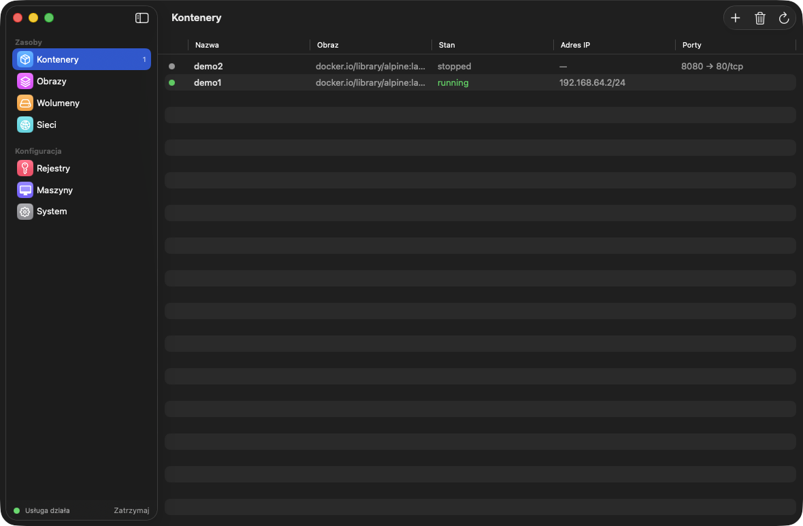
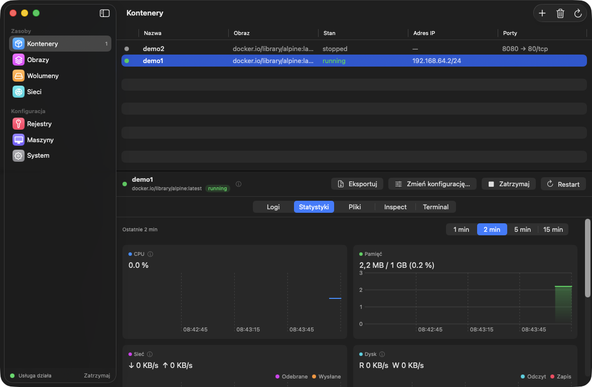
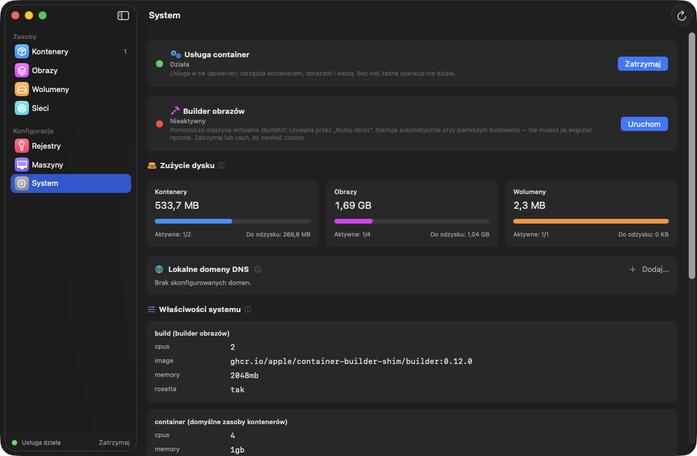
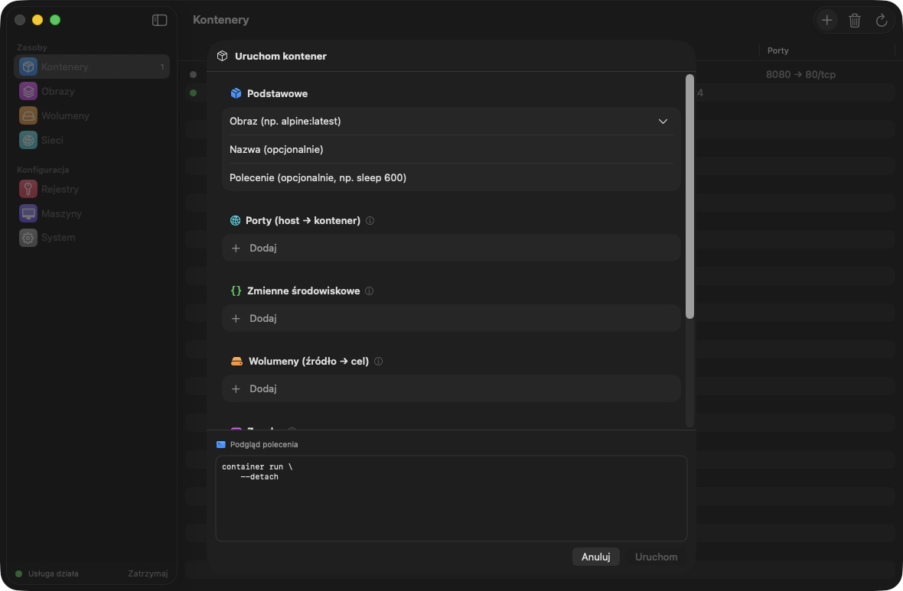

# Container Desktop

[English](README.md) | **Polski**

Natywna aplikacja macOS w stylu Docker Desktop dla CLI [`container`](https://github.com/apple/container) od Apple — zarządzaj kontenerami, obrazami, wolumenami, sieciami i maszynami z szybkiego interfejsu SwiftUI zamiast z terminala.

Container Desktop nie reimplementuje logiki kontenerów: każda akcja wywołuje oficjalne CLI `container` i parsuje jego wyjście JSON, więc to, co widzisz, jest zawsze dokładnie tym, co powiedziałoby CLI.



## Możliwości

### Kontenery
- Lista ze stanem na żywo, adresem IP i opublikowanymi portami (ze strzałkami **otwórz w przeglądarce**); panel szczegółów z **logami, statystykami na żywo, przeglądarką plików, inspect i wbudowanym terminalem** (`exec -it` przez SwiftTerm)
- Natywny podgląd logów: ciągłe zaznaczanie, kopiowanie całości, opcjonalne znaczniki czasu i **kolorowanie poziomów** (błędy na czerwono, ostrzeżenia na pomarańczowo) tolerujące składnie serilog/.NET/logfmt/klog
- Start / stop / restart / kill / usuń / wyczyść, ze wskaźnikami postępu per kontener
- Rozbudowany dialog **Uruchom kontener**: porty, zmienne środowiskowe, wolumeny (wybór istniejącego wolumenu albo lokalnego folderu), zasoby, sieć, architektura (arm64 / amd64 z automatyczną Rosettą), entrypoint, `--rm` — z podglądem dokładnego polecenia shell gotowym do skopiowania
- **Zmiana polecenia / konfiguracji** istniejącego kontenera: aplikacja odtwarza go z tą samą konfiguracją wstępnie wypełnioną do edycji (dane w wolumenach przetrwają)
- Postęp pobierania obrazu streamowany prosto do dialogu
- **Docker Compose**: wklejasz `docker-compose.yml`, a aplikacja tłumaczy go na wywołania `container run` — wspólna sieć projektu, kolejność wg zależności, grupowanie kontenerów na liście ze zbiorczym start/stop. Zadania jednorazowe (np. utworzenie bazy danych) przez rozszerzenie `x-init: true` wykonują się do końca przed startem pozostałych usług. Alias `host.containers.internal` wskazuje bramę sieci projektu (Twojego Maca widzianego z kontenerów), a nazwy usług są zszywane między kontenerami przez `/etc/hosts` (obejście zepsutego DNS nazw w container 1.0.0). Przełącznik „Pomiń zadania init" pozwala wznawiać stack bez powtarzania jednorazowej konfiguracji

### Statystyki na żywo

- CPU %, pamięć, przepływ sieci i dysku (na sekundę), liczba procesów — odświeżane co sekundę
- Natywne wykresy Swift Charts z wybieranym oknem czasu (1–15 min) i dymkami pod kursorem przyciąganymi do próbek

### Obrazy, wolumeny, sieci, rejestry, maszyny
- Pull i build (Dockerfile) ze streamowanym postępem, uruchamianie z obrazu, tag / usuwanie / czyszczenie / inspect
- Wolumeny i sieci: tworzenie, usuwanie, czyszczenie, inspect; przeglądarka plików wolumenu
- Logowania do rejestrów (hasło przekazywane bezpiecznie przez stdin)
- Maszyny: tworzenie, ustawianie domyślnej, zatrzymywanie, usuwanie

### System

- Status usługi z bezpiecznym startem/stopem (z weryfikacją skutku — CLI połyka część błędów), zużycie dysku z paskami miejsca do odzyskania, zarządzanie builderem, lokalne domeny DNS (z obsługą promptu administratora), czytelne właściwości systemu i wbudowany podgląd logów usługi

### Zaprojektowana pod macOS 26
- Akcenty Liquid Glass, kolorowy sidebar w stylu Ustawień systemowych, stany przejściowe wszędzie („Zatrzymywanie… (zatrzymuję kontenery)"), pomocne puste stany i ikonki (i) z objaśnieniami w całej aplikacji
- **Ikona w pasku menu**: status usługi, działające kontenery z zatrzymywaniem jednym kliknięciem, „zatrzymaj wszystkie", skok do dowolnej sekcji
- Lokalizacja **polska i angielska** (zgodnie z językiem systemu)



## Wymagania

- macOS 26 (Tahoe) na Apple Silicon
- Zainstalowane CLI [`container`](https://github.com/apple/container) (domyślnie `/usr/local/bin/container`; własną ścieżkę można wskazać w Ustawieniach aplikacji)

## Instalacja

### Z wydania DMG
Pobierz DMG z [Releases](../../releases), otwórz i przeciągnij **Container Desktop** do Aplikacji.

> **Uwaga o Gatekeeperze:** wydania nie są obecnie notaryzowane (brak płatnego członkostwa Apple Developer). Przy pierwszym uruchomieniu macOS ostrzeże, że aplikacja pochodzi od niezidentyfikowanego dewelopera. Wejdź w **Ustawienia systemowe → Prywatność i ochrona** i kliknij **Otwórz mimo to**, albo zdejmij kwarantannę ręcznie:
> ```bash
> xattr -dr com.apple.quarantine "/Applications/ContainerGUI.app"
> ```
> Alternatywnie zbuduj ze źródeł — to jedno polecenie.

### Budowanie ze źródeł

```bash
brew install xcodegen
git clone https://github.com/sembsa/ContainerDesktop.git && cd ContainerDesktop
xcodegen generate
xcodebuild -project ContainerGUI.xcodeproj -scheme ContainerGUI \
  -destination 'platform=macOS' -derivedDataPath .build build
open .build/Build/Products/Debug/ContainerGUI.app
```

Testy:

```bash
xcodebuild test -project ContainerGUI.xcodeproj -scheme ContainerGUI \
  -destination 'platform=macOS' -derivedDataPath .build
```

Dystrybucyjny DMG (podpis ad-hoc, bez notaryzacji):

```bash
scripts/package.sh        # tworzy dist/ContainerDesktop.dmg
```

## Architektura

```
Widoki SwiftUI (per sekcja)  →  @Observable stores  →  ContainerCLI (actor)  →  Process(container CLI)
        │                              │                       │
   MenuBarExtra                  AppModel (root)         JSON (Codable) / strumienie linii (AsyncStream)
   Wbudowany terminal (SwiftTerm, PTY)
```

- `ContainerGUI/CLI` — wykonywanie procesów z timeoutami i watchdogiem, builder argv z tokenizerem w stylu shella, strumieniowy czytnik linii
- `ContainerGUI/Models` — modele `Codable` odwzorowane na realne wyjście JSON CLI
- `ContainerGUI/Features/*` — store + widoki dla każdej sekcji
- Aplikacja działa poza App Sandbox (uruchamia zewnętrzne CLI), więc dystrybucja jest bezpośrednia (DMG), nie przez Mac App Store

## Licencja

[MIT](LICENSE)
