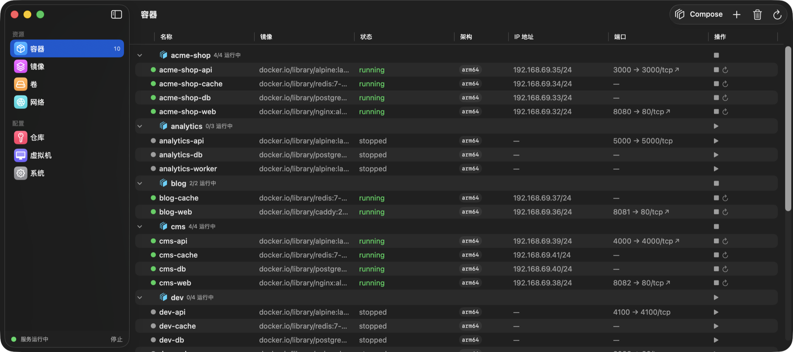
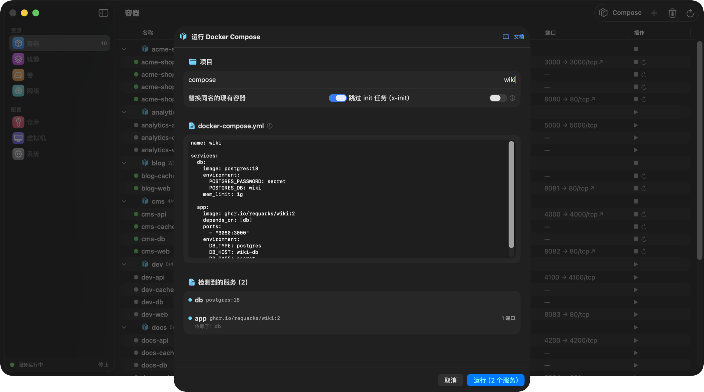
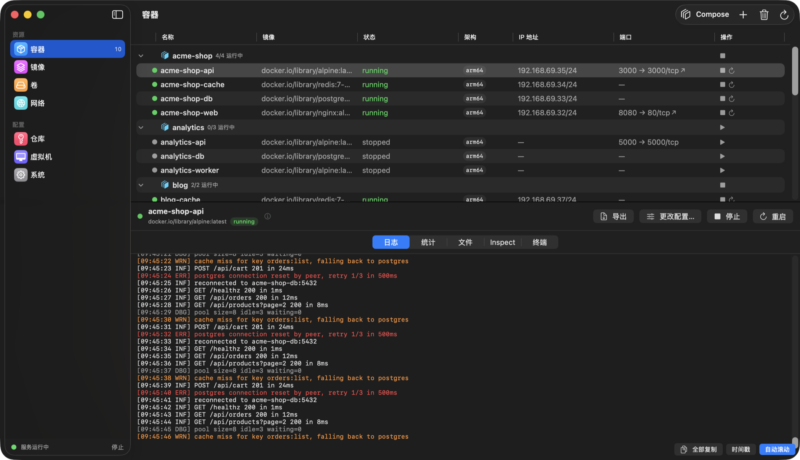
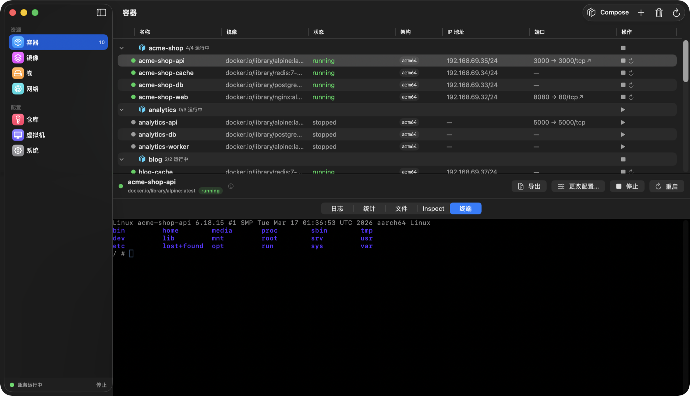
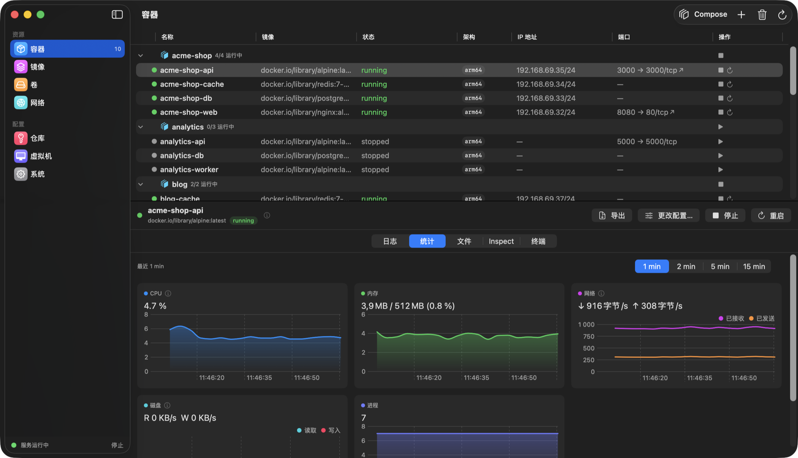
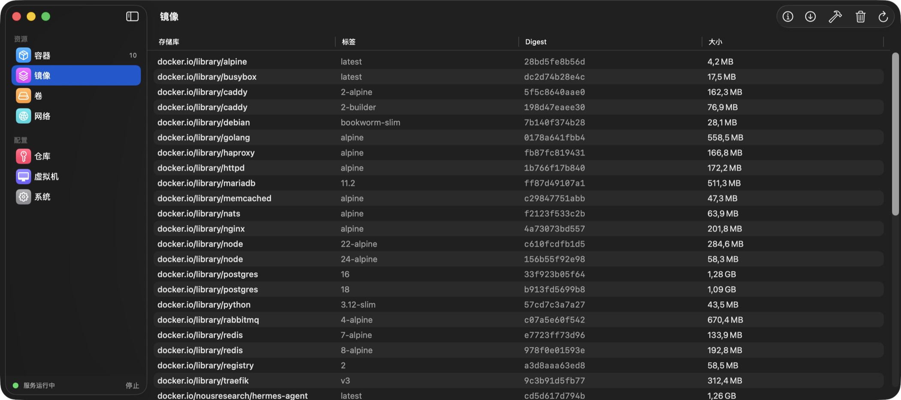
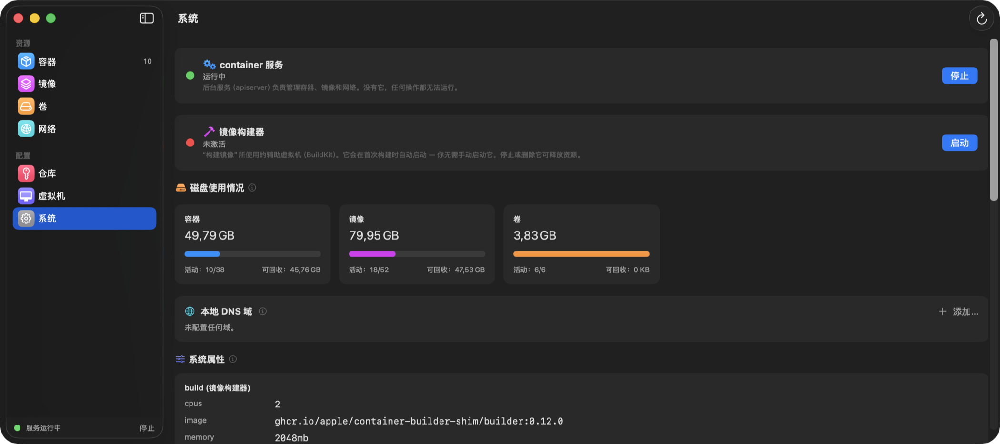
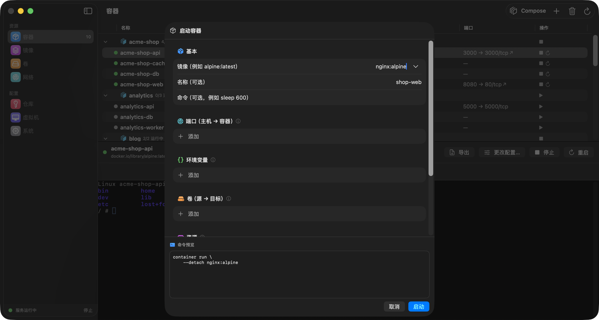

# Container Desktop

[English](README.md) | [Polski](README.pl.md) | **简体中文**

一款原生 macOS 应用，为 Apple 的 [`container`](https://github.com/apple/container) CLI 提供 Docker Desktop 风格的图形界面 —— 在快速的 SwiftUI 界面中管理容器、镜像、卷、网络和虚拟机，而不必回到终端。

Container Desktop 不重新实现任何容器逻辑：每个操作都会调用官方 `container` CLI 并解析它的 JSON 输出，因此你看到的内容始终与 CLI 所报告的完全一致。



📘 **[文档](https://sembsa.github.io/ContainerDesktop/docs.zh.html)** —— Compose 指南、`x-init` 任务、`host.containers.internal`、故障排查。

## 功能

### 容器
- 列表显示实时状态、IP 地址和已发布端口（带一键 **在浏览器中打开** 箭头）；详情面板包含 **日志、实时统计、文件浏览器、inspect 和内嵌终端**（通过 SwiftTerm 执行 `exec -it`）
- 原生日志查看器：连续选择、复制全部、可选时间戳，以及 **按级别着色**（错误为红色、警告为橙色），兼容 serilog/.NET/logfmt/klog 等写法
- 启动 / 停止 / 重启 / kill / 删除 / prune，每个容器都有独立的进度指示
- 功能完整的 **运行容器** 对话框：端口、环境变量、卷（选择已有卷或本地文件夹）、资源、网络、架构（arm64 / amd64，自动启用 Rosetta）、entrypoint、`--rm` —— 并实时预览可直接复制粘贴的完整 shell 命令
- **修改已有容器的命令 / 配置**：应用会用原有配置预填表单并重新创建该容器（卷中的数据不会丢失）
- 镜像拉取进度直接流式显示在对话框里
- **Docker Compose**：粘贴 `docker-compose.yml`，应用会把它翻译成 `container run` 调用 —— 项目网络、依赖顺序、列表中分组显示的容器以及批量启动/停止。通过 `x-init: true` 服务扩展声明的一次性初始化任务（例如创建数据库）会先执行完毕，其余服务才会启动。`host.containers.internal` 别名解析到项目网络的网关（也就是容器视角下的你的 Mac），服务主机名通过 `/etc/hosts` 在容器之间互相写入（绕开 container 1.0.0 中失效的名称 DNS）。"跳过初始化任务" 开关让你重新运行 stack 而不必重复一次性配置



按级别着色的日志，以及容器内部的完整终端：

| 日志查看器 | 内嵌终端 |
| --- | --- |
|  |  |

### 实时统计

- CPU %、内存、网络与磁盘吞吐量（每秒）、进程数 —— 每秒刷新一次
- 原生 Swift Charts，时间窗口可选（1–15 分钟），悬停提示自动吸附到采样点

### 镜像、卷、网络、注册表、虚拟机

- 拉取与构建（Dockerfile）并流式显示进度、直接从镜像运行容器、tag / 删除 / prune / inspect
- 卷和网络：创建、删除、prune、inspect；卷文件浏览器
- 注册表登录（密码通过 stdin 安全传递）
- 容器虚拟机（container machines）：创建、设为默认、停止、删除

### 系统

- 服务状态与安全的启动/停止（会验证结果 —— CLI 会吞掉一部分错误）、磁盘占用及可回收空间进度条、builder 管理、本地 DNS 域名（已处理管理员授权提示）、易读的系统属性，以及内置的服务日志查看器

### 为 macOS 26 而设计
- Liquid Glass 质感、系统设置风格的彩色侧边栏、随处可见的过渡状态（"正在停止…（正在停止容器）"）、有帮助的空状态提示，以及贯穿全应用的 (i) 说明
- **菜单栏附加项**：服务状态、运行中的容器（一键停止）、"全部停止"、跳转到任意分区
- 已本地化为 **英语、波兰语和简体中文** —— 跟随系统语言，并可在设置中切换语言（系统 / English / 中文 / Polski）。设置为其他任何语言的系统默认使用 **英语**。
- 通过 [Sparkle](https://sparkle-project.org) **自动更新**：应用菜单和菜单栏菜单里都有 *检查更新…*，appcast 使用 EdDSA 签名并由 GitHub Pages 提供



## 系统要求

- Apple Silicon 上的 macOS 26 (Tahoe)
- 已安装 [`container`](https://github.com/apple/container) CLI（默认路径 `/usr/local/bin/container`；可在应用设置中指定自定义路径）

## 安装

### 使用发布的 DMG
从 [Releases](../../releases) 下载 DMG，打开后把 **Container Desktop** 拖到"应用程序"。

> **关于 Gatekeeper：** 目前的版本尚未公证（notarization，因为没有付费的 Apple Developer 会员）。首次启动时 macOS 会提示应用来自身份不明的开发者。请打开 **系统设置 → 隐私与安全性** 并点击 **仍要打开**，或手动移除隔离标记：
> ```bash
> xattr -dr com.apple.quarantine "/Applications/ContainerGUI.app"
> ```
> 也可以从源码构建 —— 一条命令即可。

### 自动更新
安装之后，Container Desktop 会通过 [Sparkle](https://sparkle-project.org) 检查更新（也可手动使用应用菜单或菜单栏菜单中的 *检查更新…*）。更新会用 EdDSA 签名进行校验，并且 Sparkle 会为已安装的更新移除隔离标记，所以首次启动之后就不再需要 Gatekeeper 那一步。维护者的发布流程（签名/公证（如可用）→ `generate_appcast` → 发布 DMG 与 `docs/appcast.xml`）记录在 `scripts/package.sh` 中。

### 从源码构建

```bash
brew install xcodegen
git clone https://github.com/sembsa/ContainerDesktop.git && cd ContainerDesktop
xcodegen generate
xcodebuild -project ContainerGUI.xcodeproj -scheme ContainerGUI \
  -destination 'platform=macOS' -derivedDataPath .build build
open .build/Build/Products/Debug/ContainerGUI.app
```

测试：

```bash
xcodebuild test -project ContainerGUI.xcodeproj -scheme ContainerGUI \
  -destination 'platform=macOS' -derivedDataPath .build
```

可分发的 DMG（ad-hoc 签名，未公证）：

```bash
scripts/package.sh        # 生成 dist/ContainerDesktop.dmg
```

## 架构

```
SwiftUI 视图（按功能划分）  →  @Observable stores  →  ContainerCLI (actor)  →  Process(container CLI)
        │                              │                       │
   MenuBarExtra                  AppModel（根对象）        JSON (Codable) / 行流 (AsyncStream)
   内嵌终端（SwiftTerm, PTY）
```

- `ContainerGUI/CLI` —— 带超时与看门狗的进程执行、带 shell 风格分词器的 argv 构造器、流式行读取器
- `ContainerGUI/Models` —— 映射到真实 CLI JSON 输出的 `Codable` 模型
- `ContainerGUI/Features/*` —— 每个分区一个 store 加对应视图
- 应用运行在 App Sandbox 之外（因为它需要启动外部 CLI），所以采用直接分发（DMG），而不是 Mac App Store

## 许可证

[MIT](LICENSE)
